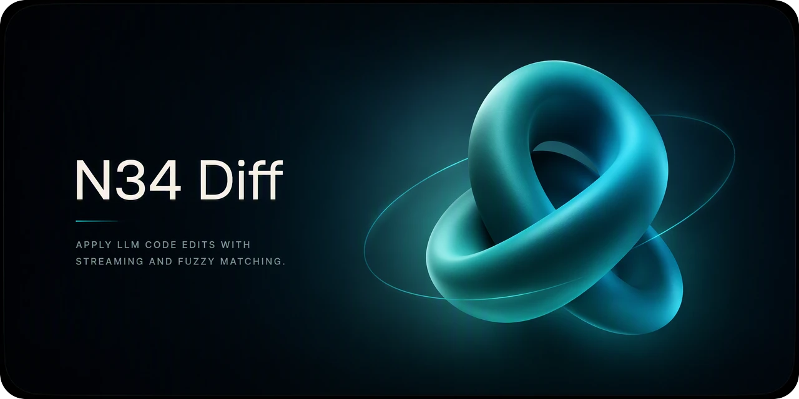
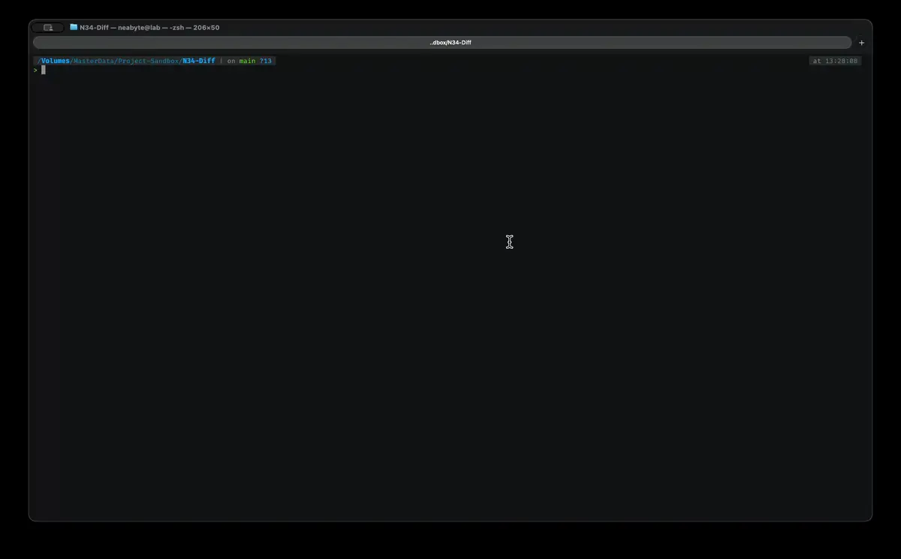

<div align='center'>



[](https://deno.com) [](https://nodejs.org) [](https://bun.sh) [](https://developer.mozilla.org/en-US/docs/Web/JavaScript)

</div>

## What is N34?

N34 is a fuzzy diff engine that applies LLM-generated edits to source text without relying on strict line numbers. Hunks are located via anchor and soft canonicalization, giving whitespace and Unicode tolerance. It runs synchronously via `apply()` for whole edits, or incrementally via `stream()` for chunked LLM output, and returns both the patched result and structured line-by-line diff metadata.

Inspired by [Morph Fast Apply](https://docs.morphllm.com/sdk/components/fast-apply) - the hosted merge model wired into agents like [Cursor](https://www.morphllm.com/blog/cursor-mcps), [Windsurf](https://www.morphllm.com/setup), [Claude Code](https://www.morphllm.com/setup), [Codex](https://www.morphllm.com/setup), [Amp](https://www.morphllm.com/setup), [OpenCode](https://github.com/morphllm/opencode-morph-plugin), [Kilo Code](https://www.youtube.com/watch?v=04_3foVQ89c), and [Antigravity](https://www.morphllm.com/setup). N34 keeps the same "apply LLM edits without line numbers" idea but runs fully in-process with zero dependencies and zero network calls, so it works the same in a browser tab, a Deno script, or an offline CLI.

Local file editing at 442 apply/s across 100 languages, and 691 apply/s at 4096 lines, with $0.00 cost, 0 network calls, 0 dependencies.

## Installation

**Deno:**

```bash
deno add npm:@neabyte/n34-diff
```

**npm:**

```bash
npm install @neabyte/n34-diff
```

**CDN (jsDelivr/esm.sh):**

```html
<script type="module">
  import N34 from 'https://cdn.jsdelivr.net/npm/@neabyte/n34-diff/dist/index.mjs'
</script>
```

Or via [esm.sh](https://esm.sh):

```html
<script type="module">
  import N34 from 'https://esm.sh/@neabyte/n34-diff'
</script>
```

## Usage

> [!WARNING]
> This is a pure text-to-text API with no filesystem I/O, designed to run in any environment including browsers, CLI, and terminal applications. Filesystem operations such as reading, writing, and deleting files are left to the consumer.

### Non-Stream

```ts
import N34 from '@neabyte/n34-diff'

const result = N34.apply(
  'function add(a, b) {\n  return a - b\n}',
  '<<<<<<< SKIP\nfunction add(a, b) {\n  return a + b\n}\n<<<<<<< SKIP',
  { timeout: 10000 }
)

console.log(result.before)
// function add(a, b) {
//   return a - b
// }

console.log(result.after)
// function add(a, b) {
//   return a + b
// }

console.log(result.diff)
// [
//   { newLine: 1, oldLine: 1, type: 'equal', value: 'function add(a, b) {' },
//   { newLine: null, oldLine: 2, type: 'delete', value: '  return a - b' },
//   { newLine: 2, oldLine: null, type: 'add', value: '  return a + b' },
//   { newLine: 3, oldLine: 3, type: 'equal', value: '}' }
// ]
```

### Stream

```ts
import N34 from '@neabyte/n34-diff'

/** Open stream with idle timeout */
const stream = N34.stream('<original_code>', {
  timeout: 10000
})

/** Emit each resolved hunk patch */
stream.callback(result => {
  console.log(result.before)
  console.log(result.after)
  console.log(result.diff)
})
stream.push(chunk1)
stream.push(chunk2)
stream.end()
```

The stream emits one `patch` per resolved hunk. Each patch has the same shape as `apply()`'s result: `before`, `after`, and structured `diff` scoped to that hunk's slice of the source.

## Examples

<div align='center'>



</div>

Runnable end-to-end demos live in [`examples/`](examples/README.md):

- [`examples/index.ts`](examples/index.ts) - Ollama chat with `apply_edit` tool call, then side-by-side diff

## API

### `N34.apply(original, edit, options?)`

| Parameter  | Type          | Description                                       |
| ---------- | ------------- | ------------------------------------------------- |
| `original` | `string`      | Original source text                              |
| `edit`     | `string`      | N34 edit body wrapped with `<<<<<<< SKIP` markers |
| `options`  | `ApplyOption` | Optional. `{ timeout?: number }` in milliseconds. |

Default timeout is `60000` ms. Pass `Infinity` to disable.

**Returns:** `ApplyResult`

```ts
type ApplyResult = {
  after: string // Patched output text
  before: string // Original source text
  diff: DiffLine[] // Structured line-by-line diff
}

type DiffLine = {
  newLine: number | null // Result line number (null for deletes)
  oldLine: number | null // Source line number (null for adds)
  type: 'add' | 'delete' | 'equal'
  value: string // Line content
}
```

### `N34.stream(original, options?)`

| Parameter  | Type          | Description                                                       |
| ---------- | ------------- | ----------------------------------------------------------------- |
| `original` | `string`      | Original source text                                              |
| `options`  | `ApplyOption` | Optional. `{ timeout?: number }` in milliseconds (idle deadline). |

The stream idle timeout resets on every `push()`. If no chunk arrives within the window, the stream closes and further pushes throw.

**Returns:** `StreamHandle`

```ts
type StreamHandle = {
  callback(listener: ((patch: ApplyResult) => void) | null): void
  end(): void
  push(chunk: string): void
}
```

- `callback(listener)` - Registers or clears the hunk listener and flushes buffered patches.
- `push(chunk)` - Feeds a text chunk while the segmenter buffers partial lines until a newline.
- `end()` - Signals end of input so remaining buffered text flushes and final hunks are emitted.

## LLM Tool Schemas

Pre-built schemas for tool calling live in [`schemas/`](schemas/README.md):

- [`schemas/openai.json`](schemas/openai.json) - OpenAI function calling format
- [`schemas/anthropic.json`](schemas/anthropic.json) - Anthropic tool use format

## Build

```bash
npm run build
```

## Testing

```bash
deno task check
```

```bash
deno task test
```

## Benchmark

```bash
deno task bench
```

Runnable end-to-end benchmarks live in [`bench/`](bench/):

- [`bench/apply.bench.ts`](bench/apply.bench.ts) - `N34.apply()` across 100-language corpus and scaling ladder
- [`bench/stream.bench.ts`](bench/stream.bench.ts) - `N34.stream()` across edge cases and chunk-width ladder
- [`bench/output.txt`](bench/output.txt) - Latest recorded run for reference

## License

Code in this repository is licensed under [Apache 2.0](./LICENSE), documentation is licensed under [CC-BY-4.0](https://creativecommons.org/licenses/by/4.0/).
